# Azure Quota Verification

Verify Azure quotas exist for services before deployment. Supports vCPU, App Service Plans, AKS, Container Apps, and Public IPs. Auto-generates quota-increase requests.

Platform-agnostic PowerShell scripts that work with any CI/CD tool, plus GitHub Actions integration.

## Quick Start: Choose Your Integration

### 🚀 Using GitHub Actions?

```bash
cd your-repo
cp -r github-actions/.github .
cp scripts/ .
cp quota-config.sample.json quota-config.json
```

Then follow: [`github-actions/README.md`](github-actions/README.md)

### 🔧 Using Jenkins, GitLab CI, Azure DevOps, or Custom Pipeline?

```bash
cp -r scripts/ your-repo/
cp quota-config.sample.json your-repo/quota-config.json
```

Then:
1. Follow: [`scripts/README.md`](scripts/README.md) for script usage
2. Copy example config from `examples/<your-ci-tool>/`
3. Customize and integrate

### 📋 All Platforms

1. Create Azure service principal with Reader role
2. Store credentials in your CI/CD platform
3. Edit `quota-config.json` with your requirements
4. Commit and run

## Repository Structure


```
azure-quota-check/
├── README.md (this file)
├── quota-config.sample.json (template config)
├── QUOTA_README.md (legacy; see github-actions/README.md and scripts/README.md)
│
├── github-actions/ (GitHub Actions integration)
│   ├── README.md (setup guide)
│   └── workflows/
│       └── azure-quota-verification.yml
│
├── scripts/ (pure PowerShell, CI/CD agnostic)
│   ├── README.md (usage guide)
│   ├── check-azure-quotas.ps1 (main quota checker)
│   ├── request-azure-quota.ps1 (adjustable quota requests)
│   ├── submit-azure-support-ticket.ps1 (support-ticket fallback)
│   └── create-github-quota-issue.ps1 (GitHub issue fallback)
│
└── examples/ (sample CI/CD configurations)
    ├── jenkins/Jenkinsfile
    ├── gitlab-ci/.gitlab-ci.yml
    └── azure-devops/azure-pipelines.yml
```

## Core Features

| Resource | Source | Check Type |
|----------|--------|-----------|
| vCPU and VM families | `az quota` | Available capacity |
| Exact VM SKUs | `az vm list-skus` + `az quota` | Regional/subscription availability + family capacity |
| App Service plan tiers | `az appservice list-locations` + Microsoft.Web `usages` REST API | Regional availability + tier-specific capacity |
| AKS dependencies | `az quota` | VM-family and network capacity |
| Container Apps | `az quota` | Environment and workload-profile capacity |
| Public IPs | `az quota` | Available capacity |

## How It Works

1. **Authenticate** with Azure (service principal or user credentials)
2. **Query quota limits and usage** with the Azure CLI quota extension
3. **Compare** remaining capacity against `quota-config.json` requirements
4. **Generate artifacts** if any quota is insufficient:
   - Human-readable markdown summary
   - Per-resource JSON details
5. **Exit with code 2** to signal deployment halt
6. **Offer 4 submission options** for quota increases:
   - Azure Portal (manual)
   - Azure Quota API through `az quota update`
   - Azure Support API fallback
   - GitHub issue fallback

## Workflow Diagram

```mermaid
flowchart TD
    A[Deployment pipeline starts] --> B[Authenticate to Azure]
    B --> C{Azure context matches<br/>configured subscription?}
    C -- No --> X1[Exit 3: configuration or authentication error]
    C -- Yes --> D0{Any entry needs az quota?<br/>i.e. not solely appServicePlanSku}
    D0 -- No --> F
    D0 -- Yes --> D{Quota extension installed?}
    D -- No --> X2[Exit 3: install Azure CLI quota extension]
    D -- Yes --> E{Microsoft.Quota registered?}
    E -- No --> X3[Exit 3: subscription owner must register provider]
    E -- Yes --> F[Load configured provider quota resources]

    F --> F1{Entry specifies vmSku?}
    F1 -- Yes --> F2[Query az vm list-skus for SKU in region]
    F2 --> F3{SKU returned and<br/>not Location-restricted?}
    F3 -- No --> F4[Record SKU availability issue<br/>not a quota deficit]
    F4 --> K
    F3 -- Yes --> F5[Resolve VM family from SKU]
    F5 --> G
    F1 -- No --> F6{Entry specifies<br/>appServicePlanSku?}

    F6 -- Yes --> F7[Query az appservice list-locations for SKU]
    F7 --> F8{SKU/version offered<br/>in region?}
    F8 -- No --> F4
    F8 -- Yes --> F9[Query Microsoft.Web usages REST API,<br/>match family + tier name]
    F9 --> F10{Matching tier<br/>quota entry found?}
    F10 -- No --> X4[Exit 3: tier/family mismatch, fix config]
    F10 -- Yes --> I2[Calculate available = limit - usage<br/>mark submissionMethod: support-ticket]
    I2 --> J
    F6 -- No --> G

    G[Query limit with az quota show] --> H[Query usage with az quota usage show]
    H --> I[Calculate available = limit - usage]
    I --> J{Available capacity meets<br/>deployment requirement?}

    J -- Yes --> K{More configured quotas?}
    K -- Yes --> F

    J -- No --> L[Calculate requested limit]
    L --> M[Write per-resource JSON artifact]
    M --> N[Write Markdown summary]
    N --> K

    K -- No --> O{Any deficits or<br/>SKU issues recorded?}
    O -- No --> P[Exit 0: allow deployment]
    O -- Yes --> Q[Exit 2: halt deployment]

    Q --> R{Choose remediation path}
    R --> R1[SKU issue: change region<br/>or SKU - not fixable by quota request]
    R --> S[Azure Portal request]
    R --> T[Preview request-azure-quota.ps1]
    R --> U[Preview support-ticket payloads]
    R --> V[Create GitHub issue]

    T --> T0{Deficit submissionMethod<br/>== support-ticket?}
    T0 -- Yes --> T5[Skip with warning:<br/>route to submit-azure-support-ticket.ps1]
    T5 --> U
    T0 -- No --> T1{Explicit -Submit<br/>and Quota Request Operator?}
    T1 -- No --> T2[Dry-run only]
    T1 -- Yes --> T3[Submit az quota update]
    T3 --> T4[Check quota request status]

    U --> U1{Explicit -Submit<br/>and Support permissions?}
    U1 -- No --> U2[Dry-run only]
    U1 -- Yes --> U3[Create one support ticket<br/>per quota category]

    S --> W[Azure processes request]
    T4 --> W
    U3 --> W
    V --> Y[Cloud operations reviews issue]
    R1 --> Z[Re-run quota validation]
    W --> Z
    Y --> Z
    Z --> F
```



The request scripts are dry-run-first. They do not change quota or create
support tickets unless `-Submit` is explicitly supplied.

## Exit Codes

- **0**: All checks passed ✅
- **2**: Quotas insufficient; artifacts generated ⚠️
- **3+**: Script error ❌

## Configuration

### quota-config.json

```json
{
  "subscriptionId": "your-subscription-id",
  "location": "eastus",
  "quotas": [
    {
      "name": "Standard D-family v5 vCPUs",
      "providerNamespace": "Microsoft.Compute",
      "vmSku": "Standard_D4s_v5",
      "resourceType": "dedicated",
      "requiredAvailable": 16
    },
    {
      "name": "Total regional vCPUs",
      "providerNamespace": "Microsoft.Compute",
      "resourceName": "cores",
      "resourceType": "dedicated",
      "requiredAvailable": 10
    }
  ]
}
```

Use `az quota list` to discover the quota resource names exposed for each
provider and region. AKS and App Service must be represented by the underlying
VM-family, networking, environment, or SKU quotas consumed by the deployment.

Set `vmSku` on a quota entry (instead of `resourceName`) to validate that an
exact VM SKU (e.g. `Standard_D4s_v5`) is available in the target region for
the subscription — not just that its VM family has quota. Azure quota is
tracked per VM family, so a family can have quota while a specific SKU is
still restricted in that region. See
[scripts/README.md](scripts/README.md#sku-specific-validation) for details.

App Service Plans have separate pricing-tier "versions" of each size (e.g.
`P1V2` vs `P1V3` vs `I1V2`), and Microsoft.Web isn't onboarded to `az quota`.
Set `appServicePlanSku` (e.g. `P1V3`) and `appServicePlanTier` (e.g.
`Premium v3`) on a quota entry to validate both that the exact plan
version is offered in the region (`az appservice list-locations`) and that
its tier still has available capacity (Microsoft.Web `usages` REST API):

```json
{
  "name": "Premium v3 App Service Plan cores",
  "providerNamespace": "Microsoft.Web",
  "resourceName": "standardDADSv5Family",
  "appServicePlanSku": "P1V3",
  "appServicePlanTier": "Premium v3",
  "requiredAvailable": 4
}
```

Deficits found this way require a support ticket rather than
`az quota update` — see
[scripts/README.md](scripts/README.md#app-service-plan-versiontier-validation).

## Requesting Quota Increases

When quotas are insufficient, artifacts are generated with 4 submission options:

### Option 1: Azure Portal (Manual)

1. Go to **Help + support** → **New support request**
2. Select **Quotas** and the specific service/region
3. Attach JSON files from `artifacts/quota-requests/`
4. Submit

### Option 2: Azure Quota API (requires Quota Request Operator)

```bash
pwsh ./scripts/request-azure-quota.ps1

# Submit after reviewing the dry-run output
pwsh ./scripts/request-azure-quota.ps1 -Submit
```

### Option 3: Azure Support API fallback

```bash
pwsh ./scripts/submit-azure-support-ticket.ps1 \
  -ContactName "Your Name" \
  -ContactEmail "you@example.com" \
  -Country "USA" \
  -TimeZone "Eastern Standard Time"
```

The support script is dry-run-first and creates one ticket per quota category
only when `-Submit` is supplied.

### Option 4: GitHub Issue (Fallback, no special permissions)

```bash
export GITHUB_TOKEN="ghp_..."
pwsh ./scripts/create-github-quota-issue.ps1 \
  -Owner "your-org" \
  -Repo "your-repo" \
  -RepoToken $GITHUB_TOKEN
```

## Integration Examples

See `examples/` for sample configurations:

- **GitHub Actions**: Copy `github-actions/workflows/` to your repo's `.github/workflows/`
- **Jenkins**: Use `examples/jenkins/Jenkinsfile` as a base
- **GitLab CI**: Use `examples/gitlab-ci/.gitlab-ci.yml`
- **Azure DevOps**: Use `examples/azure-devops/azure-pipelines.yml`

## Authentication Setup

### 1. Create Service Principal

```bash
az ad sp create-for-rbac --name "quota-check" \
  --role Reader \
  --scopes /subscriptions/<subscription-id> \
  --sdk-auth -o json
```

### 2. Store Credentials

- **GitHub Actions**: Add JSON to `AZURE_CREDENTIALS` secret
- **Jenkins**: Add to Jenkins credentials store
- **GitLab CI**: Add as masked CI/CD variables
- **Azure DevOps**: Add to pipeline variable groups
- **Other**: Set `AZURE_CLIENT_ID`, `AZURE_CLIENT_SECRET`, `AZURE_TENANT_ID` env vars

### 3. Set Subscription & Region

Export environment variables or pass to scripts:

```bash
export AZURE_SUBSCRIPTION_ID="your-id"
export AZURE_LOCATION="eastus"

pwsh ./scripts/check-azure-quotas.ps1 -ConfigPath quota-config.json
```

## Local Testing

```bash
# 1. Authenticate
az login
az account set --subscription <your-id>

# 2. Edit config
cp quota-config.sample.json quota-config.json
# ... edit with your values ...

# 3. Run checker
pwsh ./scripts/check-azure-quotas.ps1 -ConfigPath quota-config.json

# 4. Check artifacts
ls artifacts/quota-requests/
```

## Troubleshooting

### Microsoft.Quota is not registered

A subscription owner must run
`az provider register --namespace Microsoft.Quota`. The validation identity
needs Reader; submitting increases requires Quota Request Operator.

### Support ticket creation fails with 403

Your principal lacks `Microsoft.Support/supportTickets/*` permissions.
Use Option 1 (Portal) or Option 3 (GitHub Issue) instead.

### vCPU usage shows empty

Regional vCPU queries may not work for all subscription types. Script skips gracefully; not a hard failure.

## Documentation
